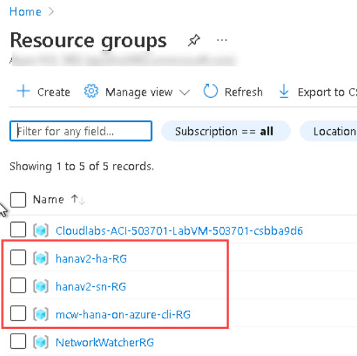
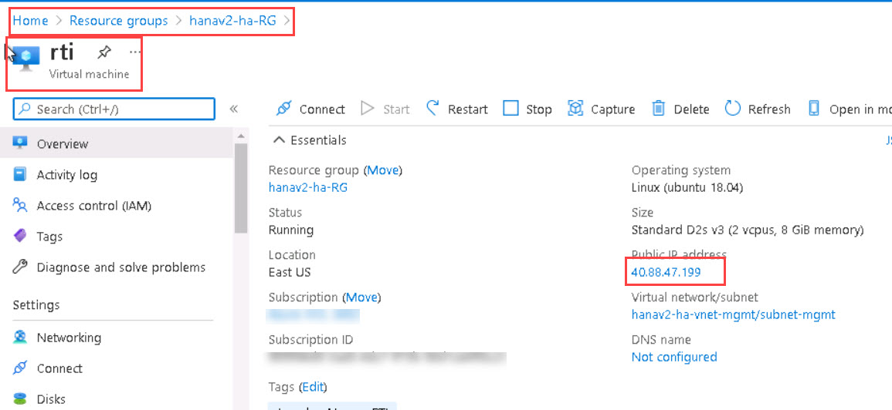
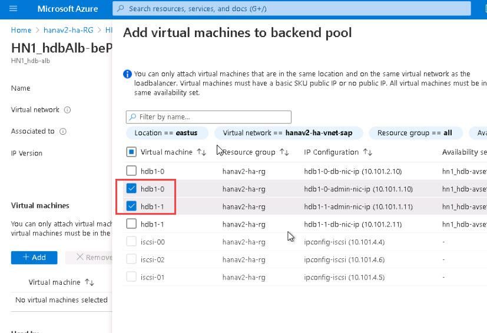

<div class="MCWHeader1">
SAP HANA on Azure
</div>

<div class="MCWHeader2">
Hands-on lab step-by-step
</div>

<div class="MCWHeader3">
November 2021
</div>


Information in this document, including URL and other Internet Web site references, is subject to change without notice. Unless otherwise noted, the example companies, organizations, products, domain names, e-mail addresses, logos, people, places, and events depicted herein are fictitious, and no association with any real company, organization, product, domain name, e-mail address, logo, person, place or event is intended or should be inferred. Complying with all applicable copyright laws is the responsibility of the user. Without limiting the rights under copyright, no part of this document may be reproduced, stored in or introduced into a retrieval system, or transmitted in any form or by any means (electronic, mechanical, photocopying, recording, or otherwise), or for any purpose, without the express written permission of Microsoft Corporation.

Microsoft may have patents, patent applications, trademarks, copyrights, or other intellectual property rights covering subject matter in this document. Except as expressly provided in any written license agreement from Microsoft, the furnishing of this document does not give you any license to these patents, trademarks, copyrights, or other intellectual property.

The names of manufacturers, products, or URLs are provided for informational purposes only and Microsoft makes no representations and warranties, either expressed, implied, or statutory, regarding these manufacturers or the use of the products with any Microsoft technologies. The inclusion of a manufacturer or product does not imply endorsement of Microsoft of the manufacturer or product. Links may be provided to third party sites. Such sites are not under the control of Microsoft and Microsoft is not responsible for the contents of any linked site or any link contained in a linked site, or any changes or updates to such sites. Microsoft is not responsible for webcasting or any other form of transmission received from any linked site. Microsoft is providing these links to you only as a convenience, and the inclusion of any link does not imply endorsement of Microsoft of the site or the products contained therein.

© 2021 Microsoft Corporation. All rights reserved.

Microsoft and the trademarks listed at https://www.microsoft.com/en-us/legal/intellectualproperty/Trademarks/Usage/General.aspx are trademarks of the Microsoft group of companies. All other trademarks are property of their respective owners.

**Contents**

<!-- TOC -->

- [SAP HANA on Azure hands-on lab step-by-step](#sap-hana-on-azure-hands-on-lab-step-by-step)
    - [Abstract and learning objectives](#abstract-and-learning-objectives)
    - [Overview](#overview)
    - [Solution architecture](#solution-architecture)
    - [Requirements](#requirements)
    - [Help references](#help-references)
    - Exercise 1: connect to the Linux virtual machine hosting lab deployment tools
    - [Exercise 2: Implement highly-available HANA instances by using Ansible](#exercise-2-Implement-highly-available-HANA-instances-by-using-Ansible)
        - [Task 1: Deploy highly-available Azure HANA instances by using Ansible](#task-2-Deploy-highly-available-Azure-HANA-instances-by-using-Ansible)
        - [Task 2: Review the deployment of highly-available HANA instances](#task-3-Review-the-deployment-of-highly-available-HANA-instances)
        - [Task 3: Install SAP HANA Client on the Windows Server jumpbox Azure VM](#task-4-Install-SAP-HANA-Client-on-the-Windows-Server-jumpbox-Azure-VM)
        - [Task 4: Test failover of the clustered resources](#task-5-Test-failover-of-the-clustered-resources)
        - [Task 5: Test fencing of the clustered resources](#task-6-Test-fencing-of-the-clustered-resources)
        - [Task 6: Test migration of the clustered resources](#task-7-Test-migration-of-the-clustered-resources)
        - [Task 7: Test fencing of the clustered resources with the AUTOMATED_REGISTER parameter enabled](#task-8-Test-fencing-of-the-clustered-resources-with-the-AUTOMATED_REGISTER-parameter-enabled)
    - [After the Hands-on lab](#after-the-hands-on-lab)


<!-- /TOC -->

# SAP HANA on Azure hands-on lab step-by-step

## Abstract and learning objectives 

In this hands-on lab, you will step through the implementation of a highly-available SAP HANA deployments on Microsoft Azure virtual machines running SUSE Linux Enterprise Server. 

After its completion, you will be able to perform highly-available SAP HANA deployments by using Terraform and Ansible, validate both types of deployments, test failover scenarios, and remove the deployed resources.

## Overview

In this hands-on lab, you are working with Contoso to develop a process of implementing an automated deployment of highly-available SAP HANA instances on Azure virtual machines (VMs). Your tasks will include the preparation for the deployment process, invoking the deployment, validating the outcome of the deployment, and removal of all the deployed resources.

## Solution architecture

HANA highly-available deployment


## Requirements

> **Note**: All the requirements provided below and the related credentials are already available in the lab environment.  

-   A Microsoft Azure subscription

-   A work or school account with the Owner role in the Azure subscription and permissions to create service principals in the Azure Active Directory (Azure AD) tenant associated with the Azure subscription

-   An SAP-user (S-user) account with access to SAP software downloads

-   A lab computer with:

    -   Access to Microsoft Azure

    -   Access to the SAP HANA software (requires an SAP Online Service System account)

    -   An SSH client such as PuTTY available from [PuTTY download page](https://www.chiark.greenend.org.uk/~sgtatham/putty/latest.html)

    -   A modern web browser (Microsoft Edge, Google Chrome, or Mozilla Firefox)

   > **Note**: You can use the Virtual Machine provided in the lab environment which has all the pre-requisites applications installed.

## Help references

|    |            |
|----------|:-------------:|
| **Description** | **Links** |
| Automated SAP Deployments in Azure Cloud | <https://github.com/Azure/sap-hana/> |


## Exercise 1: connect to the Linux virtual machine hosting lab deployment tools

1.  From the lab computer, start a Web browser, navigate to the Azure portal at https://portal.azure.com and sign in with the Azure credentials. Please find the Azure credentials for the lab below. You can also find all the credentials for the lab in the **Environment details** page : 

* Email/Username: <inject key="AzureAdUserEmail"></inject> 

* Password: <inject key="AzureAdUserPassword"></inject> 


 0
1.  Once you have successfully login to Azure, you can see 3 resource groups named **hanav2-sn-RG**, **mcw-hana-on-azure-cli-RG** and **hanav2-ha-RG**.
    * In **hanav2-sn-RG**, you can find the Jump VM and a storage account named **sapbitsXXXX**, where HANA software media download files are present.
    * In the **mcw-hana-on-azure-cli-RG**, you will be able see the pre-deployed Linux virtual machine that you will be using in the upcoming steps.
    * In **hanav2-ha-RG**, you can find the highly-available Azure infrastructure for HANA instance.
    
     
     
1.  From your computer, start the SSH client(Putty) and connect via SSH to the pre-provisioned Azure VM via the `SSH VM DNS NAME` you identified in the lab environment details page. When prompted to sign in, authenticate by using the **SSH VM Username** and the "**SSH VM Password**" provided in the lab environment details page.

    

## Exercise 2: Implement highly-available HANA instances by using Ansible

Duration: 120 minutes

In this exercise, you will implement a highly-available deployment of SAP HANA on Azure virtual machines (VMs). In this lab, you will be having access to **hanav2-ha-RG** where you can find the pre-deployed highly-available Azure infrastructure . You will use Ansible to deploy and configure all the SAP components. 

You will leverage the below artifact to complete this lab:

-   HANA software that you uploaded to an Azure Storage account.
     This storage account is pre-created and can be found in the resource group named **hanav2-sn-RG** 
-   The Highly-available Azure Infrastructure for HANA instance deployed in the RG named **hanav2-ha-RG** 

### Task 1: Deploy highly-available Azure HANA instances by using Ansible

1.  From your computer, start the SSH client(Putty) and connect via SSH to the pre-provisioned Azure VM via the `SSH VM DNS NAME` you identified in the lab environment details page. When prompted to sign in, authenticate by using the **SSH VM Username** and the "**SSH VM Password**" provided in the lab environment details page.

    

1.  In the SSH session to the Azure VM you provisioned in the previous task, run the following to authenticate to the Azure AD tenant associated with your Azure subscription:

    ```sh
    az login
    ```
    Note the code displayed as the output of the above command. You will use it in the next step.
    
1. Switch to your lab computer, open another tab in the browser window displaying the Azure portal, navigate to [the Microsoft Device Login page](https://microsoft.com/devicelogin) and, when prompted, enter the code and select **Next**.

1.  When prompted, sign in with credentials you are using in this lab and close the browser tab.

1.  Go back to Azure portal, open the resource group named "**hanav2-ha-RG**" and then open "**rti**" virtual machine. This is your Linux Jumpbox VM. Copy the IP Address of the rti vm from the virtual machine Page.

    

1.  Within the SSH session to the Azure VM , run the following to connect via SSH to the Linux jumpbox VM. While running the cammand replace [IP_address] with the IP Address of the RTI vm that you just copied in the previous step.

    ```sh
    ssh azureadm@[IP_address]
    ```

1.  Within the SSH session to the Linux jumpbox VM, run the following to set the environment variables necessary for the Ansible-based scripts to provision the lab environment:

    ```sh
    export OBJC_DISABLE_INITIALIZE_FORK_SAFETY=YES
    export ANSIBLE_HOST_KEY_CHECKING=False
    source ~/export-clustering-sp-details.sh
    ```

1.  Within the SSH session to the Linux jumpbox VM, run the following to set the value of the **configs_path** variable necessary for the Ansible-based scripts to provision the lab environment:

    ```sh
    echo 'configs_path: ".."' >> ~/sap-hana/deploy/ansible/group_vars/all.yml
    ```

1.  Within the SSH session to the Linux jumpbox VM, run the following to copy the files necessary for the Ansible-based scripts to provision the lab environment:

    ```sh
    curl https://raw.githubusercontent.com/polichtm/sap-hana-mcw/main/deploy/hdb_sizes.json --output ~/sap-hana/deploy/hdb_sizes.json  
    curl https://raw.githubusercontent.com/polichtm/sap-hana-mcw/main/deploy/components.json --output ~/sap-hana/deploy/components.json
    curl https://raw.githubusercontent.com/polichtm/sap-hana-mcw/main/deploy/app_sizes.json --output ~/sap-hana/deploy/app_sizes.json
    curl https://raw.githubusercontent.com/polichtm/sap-hana-mcw/main/deploy/anydb_sizes.json --output ~/sap-hana/deploy/anydb_sizes.json
    curl https://raw.githubusercontent.com/polichtm/sap-hana-mcw/main/deploy/input.json --output ~/sap-hana/deploy/input.json
    ```

1.  Within the SSH session to the Linux jumpbox VM, run the following to initiate the Ansible-based provisioning of the lab environment: 
    
    > **Note**: This deployment should take about 60 minutes. You need to wait for the deployment to complete. Please make sure you don't press any key or abort the deployment.  

    ```sh
    ansible-playbook -i hosts ~/sap-hana/deploy/ansible/sap_playbook.yml
    ```

    > **Note**: Once the deployment completes, the output will include the public IP address of the Windows jumpbox VM included in the Terraform deployment, its local user name with the Administrator privileges, and its password, which you will use in the next task. 


### Task 2: Review the deployment of highly-available HANA instances

> **Note**: In this deployment, the **hdb1-0** Azure VM also has two private IP addresses **10.101.1.10** and **10.101.2.10**. The first one is meant to be used for management. You will use this IP address in this exercise. 

1.  From within the SSH session to the Linux jumpbox Azure VM, connect to the **hdb1-0** Azure VM running HANA by using its private IP address you identified earlier in this task:

    ```sh
    ssh azureadm@10.101.1.10
    ```

1.  Within the SSH session to the **hdb1-0** Azure VM, run the following to switch to the security context of the **\<sid\>adm** account and, when prompted for its password, type **Help4you**:

    ```sh
    su - hn1adm
    ```

1.  Within the SSH session to the **hdb1-0** Azure VM, run the following to sign in to the locally installed SAP HANA XS Advanced environment (when prompted, provide the password **Manager1** for the **XSA_ADMIN** user):

    ```sh
    cd /hana/shared/HN1/xs/bin
    ./xs-admin-login
    ```

1.  From the **hn1adm@hdb1-0:/hana/shared/HN1/xs/bin\>** prompt, run the following to identify the URL of the XSA Cockpit:

    ```sh
    xs apps | grep xsa-cockpit
    ```

    > **Note**: The output should resemble the following:

    ```sh
    xsa-cockpit                   STARTED           1/1         512 MB    <unlimited>    https://hdb1-0.2dqgcpdju1ee1chgs50fkwq2yg.bx.internal.cloudapp.net:51025
    ```

    > **Note**: Take the note of the URL designating the access point of xsa-cockpit. You will need it later in this exercise.

1.  Within the SSH session to the **hdb1-0** Azure VM, run the following to identify the **default_domain** and **api_url** XSA parameters:

    ```sh
    cat /hana/shared/HN1/global/hdb/custom/config/xscontroller.ini
    ```

    > **Note**: The output should include the following:

    ```sh
    [communication]
    default_domain = hdb1-0.2dqgcpdju1ee1chgs50fkwq2yg.bx.internal.cloudapp.net
    api_url = https://hdb1-0.2dqgcpdju1ee1chgs50fkwq2yg.bx.internal.cloudapp.net:30030
    ```

1.  Within the SSH session to the **hdb1-0** Azure VM, type `exit` to return to the `azureadm@hdb1-0:~>` prompt.

1.  Switch to the lab computer and initiate a Remote Desktop session to the Windows Server jumpbox Azure VM **hanav2jmp-vm0** which public IP address you identified in the previous task. When prompted, sign in by using the **azureadm** username and the **Sap@hana2019!** password.

1.  Within the Remote Desktop session to the Windows Server jumpbox Azure VM **hanav2jmp-vm0**, navigate to the **Local Server** view in the **Server Manager** window and disable **IE Enhanced Security Configuration**.

1.  Within the Remote Desktop session to the Windows Server jumpbox Azure VM **hanav2jmp-vm0**, open the **hosts** file located in **C:\\Windows\\System32\\drivers\\etc** in Notepad.

1.  Add the following entries to the host file (replace the `ADD_THE_DOMAIN_HERE.bx.internal.cloudapp.net` with the domain name portion of the xsa-cockpit URL you identified earlier in this task), save your changes, and close the file:

    ```
    10.101.2.10	hdb1-0.<ADD_THE_DOMAIN_HERE.bx.internal.cloudapp.net> hdb1-0
    10.101.2.11	hdb1-1.<ADD_THE_DOMAIN_HERE.bx.internal.cloudapp.net> hdb1-1
    10.101.2.4	hdbha

    ```

    > **Note**: `10.101.2.4` is the IP address assigned to the front end of the Azure Internal Load Balancer that distributes network traffic to the HANA cluster hosted on two Azure VMs **hdb1-0** and **hdb1-1**.

1.  Within the Remote Desktop session to the Windows Server jumpbox Azure VM **hanav2jmp-vm0**, start Internet Explorer, browse to [Microsoft Edge for Business Download page](https://www.microsoft.com/en-us/edge/business/download), and use it to download and install Microsoft Edge. 

1.  Switch back to [the Azure portal](https://portal.azure.com) opened in your Jump VM, search for and select **Network security groups** and, on the **Network security groups** blade, select the entry representing the **nsg-db** network security group in the **hanav2-ha-RG** resource group.

    > **Note**: Make sure that you select the **nsg-db** network security group in the **hanav2-ha-RG** resource group (rather than the one in the **hanav2-sn-RG** resource group).

    > **Note**: The **nsg-db** network security group restrict connectivity to the Azure VMs hosting the HANA databases. In order to proceed with further testing within the lab environment, you need to allow incoming traffic from the jumpbox VM running Windows Server 2019 and from load balancer probes (which are currently denied) to the virtual network hosting the load balancer Azure VMs running HANA.

1.  On the **nsg-db** blade, select **Inbound security rules** and then select **+ Add**. 

1.  On the **Add inbound security rule** blade, specify the following settings (leave others with their default values), and select **Add**:

    | Setting | Value |
    | --- | --- |
    | Source | **Any** |
    | Source port ranges | **\*** |
    | Destination | **IP Addresses** |
    | Destination IP addresses/CIDR ranges | **10.101.0.0/16** |
    | Destination port ranges | * |
    | Protocol | **Any** |
    | Action | **Allow** |
    | Priority | **100** |
    | Name | **allow-lab-traffic** |

1.  In the Azure portal, search for and select **Load balancers** and, on the **Load balancers** blade, select the **HN1_hdb-alb** entry in the **hanav2-ha-RG** resource group. 

    > **Note**: The **HN1_hdb-alb** load balancer provides load balancing for connections targeting Azure VMs hosting the HANA databases. In order to proceed with testing in the lab environment, you need to modify the backend pool of the load balancer.

1.  On the **HN1_hdb-alb** blade, select **Backend pools**. 

1.  On the **HN1_hdb-alb \| Backend pools** blade, in the **HN1_hdb-alb-bep** section, select the **HN1_hdbAlb-bePool** link next to the **hdb1-0** entry.

1.  On the **HN1_hdbAlb-bePool** blade, in the **Virtual machines** section, select the **hdb1-0** and the **hdb1-1** checkboxes and select **Remove**.

1.  On the **HN1_hdbAlb-bePool** blade, in the **Virtual machines** section, select **Add**.

1.  On the **Add virtual machines to backend pool** blade, select the entry referencing **hdb1-0-admin-nic-ip (10.101.1.10)** and **hdb1-1-admin-nic-ip (10.101.1.11)** and then select **Add**.

     

    > **Note**: Make sure to select the IP Configuration entries that reference IP addresses on the **10.101.1.0/24** subnet. This is necessary to allow for the traffic originating from the Windows Server jumpbox Azure VM to reach the backend pool VMs.

1.  Back on the **HN1_hdbAlb-bePool** blade, select **Save**.

1.  Within the Remote Desktop session to the Windows Server jumpbox Azure VM **hanav2jmp-vm0**, start **Microsoft Edge**, and browse to **https://hdb1-0:7630**. 

1.  Disregard the **This connection isn't private** error message, select **Advanced**, and then select **Continue to hdb1-0 (unsafe)**. 

    > **Note**: Ignore any messages indicating problems with security certificate of the target website. This is expected in the lab environment. 

1.  On the **SUSE Hawk Sign in** page, sign in as **hacluster** with the password **ASecurePa55w0rd**.

1.  Once you signed in, review the **Resources** tab on the **Status** page.

    

1.  Next, switch to the **Nodes** tab on the **Status** page.

    

1.  Switch back to the **Resources** tab and use the magnifying glass icon to examine the state of the HANA resources starting with the **SAPHANATopology**.

    

1.  Close the **SAPHANATopology** pane and use the magnifying glass icon to examine the state of the **SAPHana** resource.

    

1.  Within the Remote Desktop session to the Windows Server jumpbox Azure VM **hanav2jmp-vm0**, start another instance of **Microsoft Edge**, and browse to **https://hdb1-1:7630**. 

    > **Note**: This connection targets the Azure VM hosting the passive HANA instance.

1.  Disregard the **This connection isn't private** error message, select **Advanced**, and then select **Continue to hdb1-0 (unsafe)**. 

1.  On the **SUSE Hawk Sign in** page, sign in as **hacluster** with the password **ASecurePa55w0rd**.

1.  Once you signed in, verify that you can view the status of the cluster in the same manner as when connected to **https://hdb1-0:7630**.

1.  Within the Remote Desktop session to the Windows Server jumpbox Azure VM **hanav2jmp-vm0**, start **Microsoft Edge**, and browse to the XSA Cockpit URL you identified earlier in this task.

    > **Note**: The URL should resemble **hdb1-0.cfrxsszyu1sutpvevprr2hn0rc.bx.internal.cloudapp.net** (the domain name will differ).

1.  Disregard the **This connection isn't private** error message, select **Advanced**, and then select **Continue to hdb1-0.cfrxsszyu1sutpvevprr2hn0rc.bx.internal.cloudapp.net (unsafe)**. 

    > **Note**: Ignore any messages indicating problems with security certificate of the target website. This is expected in the lab environment. 

1.  On the **SAP HANA XS Advanced** page, sign in as **XSA_ADMIN** with the password **Manager1**.

1.  Once you signed in, on the **XSA Host: Home - Organizations** page, select **User management**:

    

1.  On the **XSA Host: Home - User Management** page, select **New User**:

    

1.  In the **New User** pane, specify the following settings and select **Create**:

    | Setting | Value |
    | --- | --- |
    | User Name | **labuser1** |
    | First Name | **lab** |
    | Last Name | **user1** |
    | E-Mail | **labuser1@contoso.com** | 
    | Password | **Lab@pass123** | 

    

    


### Task 3: Install SAP HANA Client on the Windows Server jumpbox Azure VM

> **Note**: It is possible to automate the client installation by adding the following section to the windows jumpbox section of the deployment template:

    ```json
    "components": [
          "hana_client_windows"
        ]
    ```

1.  Within the Remote Desktop session to Windows Server jumpbox Azure VM **hanav2jmp-vm0**, start **Microsoft Edge**, and browse to [SAP HANA Client 2.0 download page](https://tools.hana.ondemand.com/#hanatools).

1.  From the [SAP HANA Client 2.0 download page](https://tools.hana.ondemand.com/#hanatools), download the latest version of the HANA client for Windows x64 to the **Downloads** folder, extract its content, and double-click the **hdbsetup.exe** file to start the installation.

1.  On the **Define Client Properties** page of the **SAP HANA Lifecycle Management** wizard, accept the default settings and select **Next**:

    

1.  On the **Review & Confirm** page of the **SAP HANA Lifecycle Management** wizard, accept the default settings and select **Install**:

    

1.  Wait for the installation to complete and select **Finish**.

1.  Within the Remote Desktop session to the Windows Server jumpbox Azure VM **hanav2jmp-vm0**, start **Command Prompt**. 

1.  Within the Remote Desktop session to the Windows Server jumpbox Azure VM **hanav2jmp-vm0**, in the **Command Prompt** window, run the following to connect the newly installed SAP HANA Client 2.0 to the active HANA instance via the load balancer:

    ```cmd
    cd C:\Program Files\sap\hdbclient
    hdbsql -n hdbha:30013 -d systemdb -u SYSTEM -p Manager1
    ```

    > **Note**: Make sure not to include the `-e` switch since this will result in an untrusted certificate-related error **-10709: Connection failed (RTE:[300015] SSL certificate validation failed: The certificate chain was issued by an authority that is not trusted.**

    > **Note**: You should see the output similar to the following:

    ```
    Welcome to the SAP HANA Database interactive terminal.

    Type:  \h for help with commands
           \q to quit

    hdbsql SYSTEMDB=>
    ```

1.  At the `hdbsql SYSTEMDB=>` prompt, type `\s` and press the **Enter** key to display the local SYSTEMDB information 

    > **Note**: You should see the output similar to the following:

    ```
    hdbsql SYSTEMDB=> \s
    host          : hdbha:30013
    sid           : HN1
    dbname        : SYSTEMDB
    user          : SYSTEM
    kernel version: 2.00.057.00.1629894416
    SQLDBC version:        libSQLDBCHDB 2.10.015.1634075415
    autocommit    : ON
    locale        : English_United States.1252
    input encoding: UTF8
    sql port      : hdb1-0:30013
    ```

    > **Note**: Review the output, including the **sql port** entry, which allows you to identify the target HANA instance. You will use this method to verify connectivity to HANA in the subsequent tasks of this exercise.


### Task 4: Test failover of the clustered resources

> **Note**: The remaining tasks within this exercise rely on **SUSE Hawk** to manipulate properties of HANA clustered resources. You can also use for this purpose cluster resource manager (CRM) shell interface.

1.  Within the Remote Desktop session to **hanav2jmp-vm0** Azure VM, in the Microsoft Edge window displaying the **SUSE Hawk** page, from the **msl\_SAPHana\_HN1\_HDB01** pane, verify that **hdb1-0** is currently serving the master role. Then close the **msl\_SAPHana\_HN1\_HDB01** pane.

    

1.  Switch to the SSH session to **hb1-0** and run the following to stop the Pacemaker Cluster Resource Manager monitor on the first cluster node:

    ```sh
    sudo service pacemaker stop
    ```

1.  Switch back to the Remote Desktop session to the **hanav2jmp-vm0** Azure VM and, in the Microsoft Edge window displaying the **SUSE Hawk** page connected to **https://hdb1-1:7630**, observe how the status of the resource changes first to a question mark and then to a blue dot.

    

    

    > **Note**: You might need to wait a few minutes before the operational state stabilizes.

1.  Switch to the **Command Prompt** window and, at the `hdbsql SYSTEMDB=>` prompt, type `\s` and press the **Enter** key to display the local SYSTEMDB information 

    > **Note**: You should see the output similar to the following:

    ```
    hdbsql SYSTEMDB=> \s
    host          : hdbha:30013
    sid           : HN1
    dbname        : SYSTEMDB
    user          : SYSTEM
    kernel version: 2.00.057.00.1629894416
    SQLDBC version:        libSQLDBCHDB 2.10.015.1634075415
    autocommit    : ON
    locale        : English_United States.1252
    input encoding: UTF8
    sql port      : hdb1-1:30013
    ```

    > **Note**: Review the output, including the **sql port** entry, which allows you to identify the target HANA instance. Verify that it includes the reference to **hdb1-1**.

1.  Switch to the SSH session to the **hdb1-0** Azure VM, type `exit` to return to the SSH session to the Linux jumpbox Azure VM.

1.  From within the SSH session to the Linux jumpbox Azure VM, connect to the **hdb1-1** Azure VM running HANA by using its private IP address:

    ```sh
    ssh azureadm@10.101.1.11
    ```

1.  From within to the SSH session to the **hdb1-1** Azure VM, run the following to switch to the security context of the **\<sid\>adm** account and, when prompted for its password, type **Help4you**:

    ```sh
    su - hn1adm
    ```

1.  Within the SSH session to the **hdb1-1** Azure VM, run the following to open the **xscontroller.ini** file for editing:

    ```sh
    vi /hana/shared/HN1/global/hdb/custom/config/xscontroller.ini
    ```

    > **Note**: You can use any Linux editor based on your preferences. 
   

1.  Within the editor interface, update the value of the **default_domain** and **api_url** parameters to reference the **hdb1-1** cluster node and close the file, saving your changes. 

    > **Note**: The entries you edit should resemble the following (the domain name will be different):

    ```sh
    default_domain = hdb1-1.<UPDATE_DOMAIN_NAME>.bx.internal.cloudapp.net
    api_url = https://hdb1-1.<UPDATE_DOMAIN_NAME>.bx.internal.cloudapp.net:30030
    ```
1.  Once you have updated the entries in the file, click on **ctrl+[**, then type "**:wq**" to save the updates in the file.


1.  Within the SSH session to the **hdb1-1** Azure VM, run the following to reset the certificate for the controller API. 

    ```sh
    cd /hana/shared/HN1/xs/bin    
    XSA reset-certificate
    ```

    > **Note**: Wait for the XSA service to restart. This might take a few minutes.

    > **Note**: For details regarding this procedure, refer to [SAP Note #2243019](https://launchpad.support.sap.com/#/notes/2243019)

1.  Within the SSH session to the **hdb1-1** Azure VM, run the following to sign in to the locally installed SAP HANA XS Advanced environment (when prompted, provide the password **Manager1** for the **XSA_ADMIN** user):

    ```sh
    ./xs-admin-login
    ```

1.  From the **hn1adm@hdb1-0:/hana/shared/HN1/xs/bin\>** prompt, run the following to identify the URL of XSA Cockpit:

    ```sh
    xs apps | grep xsa-cockpit
    ```

    > **Note**: The output should resemble the following (the domain name will be different):

    ```sh
    xsa-cockpit                   STARTED           1/1         512 MB    <unlimited>   hdb1-1.2dqgcpdju1ee1chgs50fkwq2yg.bx.internal.cloudapp.net:51025
    ```

    > **Note**: Take the note of the URL designating the access point of xsa-cockpit. You will need it next.

1.  Switch back to the Remote Desktop session to the **hanav2jmp-vm0** Azure VM and, start Microsoft Edge, and navigate to the XSA Cockpit URL you identified in the previous step. 

1.  Disregard the **This connection isn't private** error message, select **Advanced**, and then select **Continue to https://hdb1-1.2dqgcpdju1ee1chgs50fkwq2yg.bx.internal.cloudapp.net (unsafe)**. 

1.  On the **SAP HANA XS Advanced** page, sign in as **XSA_ADMIN** with the password **Manager1**.

1.  Once you signed in, on the **XSA Host: Home - Organizations** page, select **User management** and verify that the list of users on **XSA Host: Home - User Management** page includes the user account you created in the previous task.

    

1.  Switch to the SSH session to the **hb1-1** Azure VM, type `exit` twice to return to the SSH session to the Linux jumpbox Azure VM.

1.  From within the SSH session to the Linux jumpbox Azure VM, connect to the **hdb1-0** Azure VM running HANA by using its private IP address:

    ```sh
    ssh azureadm@10.101.1.10
    ```

1.  From within the SSH session to the **hdb1-0** Azure VM, run the following command to start the Pacemaker Cluster Resource Manager monitor on the first cluster node:

    ```sh
    sudo service pacemaker start
    ```

1.  Switch back to the Remote Desktop session to **hanav2jmp-vm0** Azure VM, review the **SUSE Hawk Status** page at **https://hdb1-1:7630**, and observe how the status of some of the clustered resources is changing to include references to both hdb1-0 and hdb1-1:

    > **Note**: The **msl_SAPHana_HN1_HDB00** resource does not automatically add **hdb1-0** as the passive node, as indicated by the error message. This is expected, since the **AUTOMATED_REGISTER** parameter of the resource is set to **false**. The **AUTOMATED_REGISTER** parameter defines, whether a former primary instance should be registered automatically by the resource agent during cluster or resource start.

    

1.  Switch to the SSH session to the **hdb1-0** Azure VM, run the following to switch to the security context of the **\<sid\>adm** account and, when prompted for its password, type **Help4you**:

    ```sh
    su - hn1adm
    ```

1.  Within the SSH session to the **hdb1-0** Azure VM, run the following to ensure that the HANA instance is stopped:

    ```sh
    sapcontrol -nr 00 -function StopWait 600 10
    ```

1.  Within the SSH session to the **hdb1-0** Azure VM, run the following to re-configure the local HANA instance as secondary:

    ```sh
    hdbnsutil -sr_register --remoteHost=hdb1-1 --remoteInstance=00 --replicationMode=sync --name=SITE1
    ```

1.  Within the SSH session to the **hdb1-0** Azure VM, run the following to switch back to root context and clean up the failed state:

    ```sh
    exit
    sudo crm resource cleanup msl_SAPHana_HN1_HDB00 hdb1-0
    ```

1.  Switch back to the Remote Desktop session to **hanav2jmp-vm0** Azure VM, review the **SUSE Hawk Status** page at **https://hdb1-1:7630**, and observe how the **SAPHana** clustered resource status is changing to operational on both hdb1-0 and hdb1-1 with the latter as the primary (you might need to wait a few minutes for the interface to refresh):

    


### Task 5: Test fencing of the clustered resources

1.  Within the Remote Desktop session to **hanav2jmp-vm0** Azure VM, in the Microsoft Edge window displaying the Azure portal, search for and select the **Virtual machines** entry, on the **Virtual machines** blade, select the entry representing the **hdb1-1** Azure VM hosting the currently active HANA instance, in the toolbar, select **Stop** and, when prompted for confirmation, select **Yes**. 

1.  Within the Remote Desktop session to **hanav2jmp-vm0** Azure VM, switch to the Microsoft Edge window displaying the **SUSE Hawk Status** page at **https://hdb1-0:7630**, wait until the status of the **msl_SAPHana_HN1_HDB01** resource in the Microsoft Edge window displaying connection to **https://hdb1-0:7630** changes from a question mark to a blue dot, and verify that its location changed to **hdb1-0**.

    

    

1.  Within the Remote Desktop session to **hanav2jmp-vm0** Azure VM, switch to the **Command Prompt** window and, at the `hdbsql SYSTEMDB=>` prompt, type `\s` and press the **Enter** key to display the local SYSTEMDB information 

    > **Note**: You should see the output similar to the following:

    ```
    hdbsql SYSTEMDB=> \s
    host          : hdbha:30013
    sid           : HN1
    dbname        : SYSTEMDB
    user          : SYSTEM
    kernel version: 2.00.057.00.1629894416
    SQLDBC version:        libSQLDBCHDB 2.10.015.1634075415
    autocommit    : ON
    locale        : English_United States.1252
    input encoding: UTF8
    sql port      : hdb1-0:30013
    ```

    > **Note**: Review the output, including the **sql port** entry, which allows you to identify the target HANA instance. Verify that it includes the reference to **hdb1-0**.

1.  Switch to the lab computer, in the Azure portal, on the **Virtual machines** blade, select the entry representing the **hdb1-1** Azure VM, in the toolbar, select **Start** and, when prompted for confirmation, select **Yes**. 

    > **Note**: The **msl_SAPHana_HN1_HDB00** resource does not automatically add **hdb1-1** as the passive node. This is expected, since the **AUTOMATED_REGISTER** parameter of the resource is set to **false**. 

1.  Wait until the **hdb1-1** Azure VM is running, switch to the SSH session to the **hb1-0** Azure VM, and type `exit` to return to the SSH session to the Linux jumpbox Azure VM.

1.  From within the SSH session to the Linux jumpbox Azure VM, connect to the **hdb1-1** Azure VM running HANA by using its private IP address:

    ```sh
    ssh azureadm@10.101.1.11
    ```

1.  Within the SSH session to the **hdb1-1** Azure VM, run the following to switch to the security context of the **\<sid\>adm** account and, when prompted for its password, type **Help4you**:

    ```sh
    su - hn1adm
    ```

1.  Within the SSH session to the **hdb1-1** Azure VM, run the following to ensure that the HANA instance is stopped:

    ```sh
    sapcontrol -nr 00 -function StopWait 600 10
    ```

1.  Within the SSH session to the **hdb1-1** Azure VM, run the following to re-configure the local HANA instance as secondary

    ```sh
    hdbnsutil -sr_register --remoteHost=hdb1-0 --remoteInstance=00 --replicationMode=sync --name=SITE2
    ```

1.  Within the SSH session to the **hdb1-1** Azure VM, run the following to switch back to root context and clean up the failed state:

    ```sh
    exit
    sudo crm resource cleanup msl_SAPHana_HN1_HDB00 hdb1-1
    ```

1.  Switch back to the Remote Desktop session to **hanav2jmp-vm0** Azure VM and, on the **SUSE Hawk Status** page at **https://hdb1-0:7630** note that the **SAPHana** clustered resource is operational on both hdb1-0 and hdb1-1 with hdb1-0 as the primary (you might need to wait a few minutes for the interface to refresh and transition from a question mark to a blue dot displayed next to the msl_SAPHana_HN1_HDB00 resource):

    

    


### Optional: Task 6: Test migration of the clustered resources

1.  Within the Remote Desktop session to **hanav2jmp-vm0** Azure VM, switch to the Microsoft Edge window displaying the **SUSE Hawk Status** page at **https://hdb1-0:7630**.

    

1.  From the **SUSE Hawk Status** page at **https://hdb1-0:7630**, select the **Migrate** option of the **SAPHana** clustered resource.

    

1.  From the **SUSE Hawk Status** page at **https://hdb1-0:7630**, select the **hdb1-1** node as the migration target.

    

1.  On the **SUSE Hawk Status** page, note that the status of **SAPHana** clustered resource is listed with a question mark, which subsequently turns into a blue dot, and chain link icons representing constraints. 

    

    

1.  Switch to the **Command Prompt** window and, at the `hdbsql SYSTEMDB=>` prompt, type `\s` and press the **Enter** key to display the local SYSTEMDB information 

    > **Note**: You should see the output similar to the following:

    ```
    hdbsql SYSTEMDB=> \s
    host          : hdbha:30013
    sid           : HN1
    dbname        : SYSTEMDB
    user          : SYSTEM
    kernel version: 2.00.057.00.1629894416
    SQLDBC version:        libSQLDBCHDB 2.10.015.1634075415
    autocommit    : ON
    locale        : English_United States.1252
    input encoding: UTF8
    sql port      : hdb1-1:30013
    ```

    > **Note**: Review the output, including the **sql port** entry, which allows you to identify the target HANA instance. Verify that it includes the reference to **hdb1-1**.

    > **Note**: At this point, the **msl_SAPHana_HN1_HDB00** resource uses only a single-node (**hdb1-1**). To allow failback to **hdb1-0**, you need to first remove the constraints that were generated automatically when you initiated the migration task. 

1.  To remove constraints, use the vertical menu on the left-hand side of the **SUSE Hawk Status** to switch to the **Edit Configuration** page and display its **Constraints** tab. 

    

    > **Note**: Ban and prefer location constraints are generated automatically during migration operation in order to prevent unintended failback to the original cluster node. However, such constraints should be removed once the original node is available to host cluster resources. 

    > **Note**: Make sure not to accidentally remove other constraints.  
    
1.  From the **Constraints** page, delete the **cli-ban-msl\_SAPHana\_HN1\_HDB00-on-hdb1-0** Location constraint.

    

1.  From the **Constraints** page, delete the **cli-prefer-msl\_SAPHana\_HN1\_HDB00** Location constraint.

    

1.  Switch back to the **SUSE Hawk Status** page at **https://hdb1-0:7630**, and note that the icons representing constraints are no longer present, however, the console displays an error message indicating a failure of the start operation for resource rsc_SAPHana_HN1_HDB00 on node hdb1-0. 

    > **Note**: The **msl_SAPHana_HN1_HDB00** resource does not automatically add **hdb1-0** as the passive node, as indicated by the error message. This is expected, since the **AUTOMATED_REGISTER** parameter of the resource is set to **false**. 

    

1.  Switch to the SSH session to the **hb1-1** Azure VM, type `exit` twice to return to the SSH session to the Linux jumpbox Azure VM.

1.  From within the SSH session to the Linux jumpbox Azure VM, connect to the **hdb1-0** Azure VM running HANA by using its private IP address:

    ```sh
    ssh azureadm@10.101.1.10
    ```

1.  Within the SSH session to the **hdb1-0** Azure VM, run the following to switch to the security context of the **\<sid\>adm** account and, when prompted for its password, type **Help4you**:

    ```sh
    su - hn1adm
    ```

1.  Within the SSH session to the **hdb1-0** Azure VM, run the following to ensure that the HANA instance is stopped:

    ```sh
    sapcontrol -nr 00 -function StopWait 600 10
    ```

1.  Within the SSH session to the **hdb1-0** Azure VM, run the following to re-configure the local HANA instance as secondary

    ```sh
    hdbnsutil -sr_register --remoteHost=hdb1-1 --remoteInstance=00 --replicationMode=sync --name=SITE1
    ```

1.  Within the SSH session to the **hdb1-0** Azure VM, run the following to switch back to root context and clean up the failed state:

    ```sh
    exit
    sudo crm resource cleanup msl_SAPHana_HN1_HDB00 hdb1-0
    ```
   
1.  Switch to the **SUSE Hawk Status** page and verify that the status indicator of the **SAPHana** clustered resource changed initially to a question mark and then to a blue dot, with hdb1-0 as the master (you might need to wait a few minutes for the interface to refresh).

    

1.  Switch to the **SUSE Hawk Status** page, and verify the **SAPHana** clustered resource is operational on both nodes with hdb1-0 as the master (you might need to wait a few minutes for the interface to refresh).

    


### Optional: Task 7: Test fencing of the clustered resources with the AUTOMATED_REGISTER parameter enabled

> **Note**: The parameter AUTOMATED_REGISTER defines, whether a former primary instance should be registered automatically by the resource agent during cluster/resource start

1.  Within the Remote Desktop session to **hanav2jmp-vm0** Azure VM, in the Microsoft Edge window displaying the **SUSE Hawk Status** page at **https://hdb1-0:7630**, select **Edit Configuration**. 

    

1.  On the **SUSE Hawk** **Edit Configuration** page **https://hdb1-0:7630**, scroll down to the **rsc_SAPHana_HN1_HDB00** clustered resource and select the edit icon (**pencil**) at the right end of its entry.

    

1.  On the **SUSE Hawk** **Edit Primitive** page **https://hdb1-0:7630**, select **Yes** in the **AUTOMATED_REGISTER** drop-down list.

    

1.  On the **SUSE Hawk** **Edit Primitive** page **https://hdb1-0:7630**, scroll down to the bottom of the page and select **Apply**.

    

1.  Within the Remote Desktop session to **hanav2jmp-vm0** Azure VM, in the Microsoft Edge window displaying the **SUSE Hawk Status** page at **https://hdb1-0:7630**, select **Status** to display the list of resources and their status. 

    

1.  Within the Remote Desktop session to **hanav2jmp-vm0** Azure VM, in the Microsoft Edge window displaying the Azure portal, search for and select the **Virtual machines** entry, on the **Virtual machines** blade, select the entry representing the **hdb1-1** Azure VM hosting the currently active HANA instance, in the toolbar, select **Stop** and, when prompted for confirmation, select **Yes**. 

1.  Within the Remote Desktop session to **hanav2jmp-vm0** Azure VM, switch to the Microsoft Edge window displaying the **SUSE Hawk Status** page at **https://hdb1-0:7630**, wait until the status of the **msl_SAPHana_HN1_HDB01** resource in the Microsoft Edge window displaying connection to **https://hdb1-0:7630** changes from a question mark to a blue dot, and verify that its location changed to **hdb1-0**.

    

1.  Switch to the lab computer, in the Azure portal, on the **Virtual machines** blade, select the entry representing the **hdb1-1** Azure VM, in the toolbar, select **Start** and, when prompted for confirmation, select **Yes**. 

1.  Switch back to the Remote Desktop session to **hanav2jmp-vm0** Azure VM and, on the **SUSE Hawk Status** page at **https://hdb1-0:7630** note that the **SAPHana** clustered resource is operational on both hdb1-0 and hdb1-1 with hdb1-1 as the primary (you might need to wait a few minutes for the interface to refresh and transition from a question mark to a blue dot displayed next to the msl_SAPHana_HN1_HDB00 resource):

    > **Note**: Pacemaker automatically adds **hdb1-1** as the passive node of the **msl_SAPHana_HN1_HDB00** resource. This is expected, since the **AUTOMATED_REGISTER** parameter of the resource is now set to **true**. 

    > **Note**: You might need to wait a few minutes for the change to be reflected in the SUSE Hawk interface.

    

    


## After the Hands-on lab 

Duration: 5 minutes

After completing the hands-on lab, remove the resource group and any remaining resources.

### Task 1: Remove the resource group containing all Azure resources deployed in this lab

1.  From the lab computer, in [the Azure portal](http://portal.azure.com) , select the **Cloud Shell** icon.

1.  If prompted, in the **Welcome to Azure Cloud Shell** window, select **Bash (Linux)**.

1.  In the **Bash** session in the **Cloud Shell** pane, run the following to select the Azure subscription in which you will provision the Azure resources in this lab (replace the `[subscription_ID]` placeholder with the value of the subscriptionID parameter of the Azure subscription you used in this lab):

    ```sh
    az account set --subscription '[subscription_ID]'
    ```

1.  In the **Bash** session in the **Cloud Shell** pane, run the following to delete all resource groups and their resources that you provisioned in this lab:

    ```sh
    if [ az group exists --name hanav2-sn-RG ]
    then
         az group delete --name hanav2-sn-RG --no-wait --yes
    fi
    az group delete --name hanav2-ha-RG --no-wait --yes
    az group delete --name mcw-hana-on-azure-cli-RG --no-wait --yes
    ```

You should follow all steps provided *after* attending the Hands-on lab.
